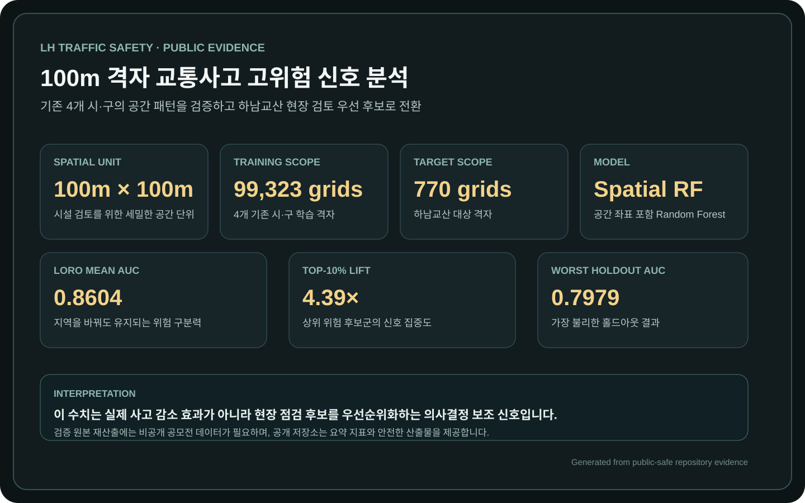
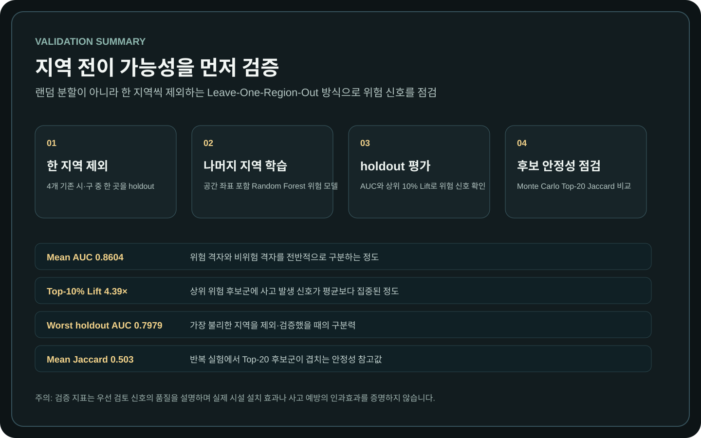
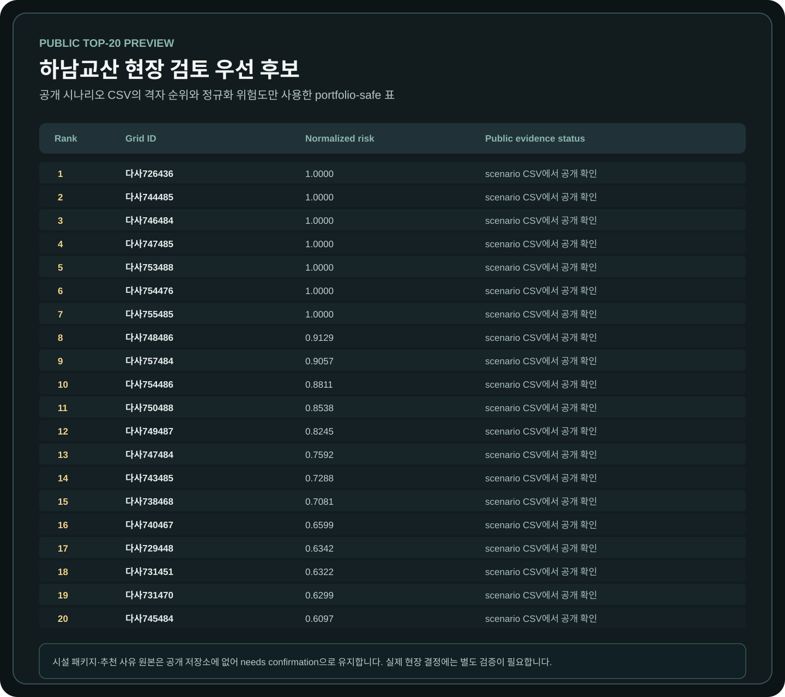

# LH Traffic Safety | 100m Grid Risk Signals

> 100m 격자 위험 예측을 안전시설 현장 검토 우선순위로 전환한 공간 위험 신호 분석

사고 이력이 부족한 신도시에서는 과거 사고 건수만으로 안전시설 우선순위를 정하기 어렵습니다. 이 프로젝트는 4개 기존 시·구 `99,323개` 100m 격자의 사고·교통·공간 패턴을 LORO로 검증하고, 하남교산 `770개` 격자를 현장 검토 후보로 우선순위화했습니다. 결과는 실제 사고 예방 효과가 아닌 **의사결정 보조 위험 신호**로 해석합니다.

행정구역 평균은 같은 지역 내부의 도로 구조와 통행 환경 차이를 가릴 수 있습니다. 그래서 `100m × 100m` 격자를 위험도 산정, 후보 비교, 시설 검토, 시나리오 확인의 공통 단위로 사용했습니다.

## Portfolio Summary

| Item | Description |
|------|-------------|
| Problem | 사고 이력이 부족한 신도시에서는 과거 사고 건수만으로 안전시설 설치 우선순위를 정하기 어렵다 |
| Target Area | 하남교산 신도시 후보 격자 |
| Training Context | 4개 기존 시·구 `99,323개` 학습 격자 |
| Target Scope | 하남교산 `770개` 대상 격자 |
| Spatial Unit | `100m × 100m` 격자 단위 위험도 산정 및 후보지 비교 |
| Core Method | 공간 좌표를 포함한 Random Forest 기반 위험 모델과 지역 간 전이 검증 |
| Validation | Mean AUC `0.8604`, Mean Top-10% Lift `4.39x`, Worst holdout AUC `0.7979` |
| Robustness | Monte Carlo 기반 Top20 후보 안정성 점검, mean Jaccard `0.503` |
| Output | 위험 격자, 현장 검토 우선 후보, 시설 패키지·추천 사유 생성 로직, 시나리오 시각화 |
| Role | 공간 분석 설계, 위험도 산정, 전이 검증, 우선순위 도출, 시각화와 문서화 수행 |

## Public Evidence

공개 증거 자산은 비공개 원천 데이터나 좌표를 새로 노출하지 않고, 저장소에서 이미 확인 가능한 범위만 요약합니다.

| Evidence | 확인 내용 |
| --- | --- |
| [Performance Summary](./docs/images/portfolio-performance-summary.svg) | 공간 단위, 학습·대상 범위, 핵심 검증 지표 |
| [Validation Summary](./docs/images/portfolio-validation-summary.svg) | LORO 흐름과 AUC·Lift·Jaccard의 평이한 해석 |
| [Public Top-20 Preview](./docs/images/public-top20-priority-preview.svg) | 공개 시나리오 CSV 기준 상위 격자 순위와 정규화 위험도 |
| [Public Top-20 CSV](./docs/data/public_top20_priority.csv) | 공개 검토용 20개 후보 표 |
| [Portfolio Case Study](./docs/portfolio_case_study.md) | 이력서 문장, 한계, 공개 근거 링크 |

시설 패키지와 추천 사유를 생성하는 코드는 존재하지만 해당 원본 결과 파일은 공개 저장소에 없습니다. 따라서 공개 Top-20 표에서는 두 필드를 `needs confirmation`으로 명시합니다.

## Project Context

신도시나 신규 개발지에서는 기존 사고 이력이 충분하지 않은 경우가 많습니다.  
이때 단순히 현재 사고 건수가 적다는 이유로 안전시설 우선순위를 낮게 잡으면, 실제 위험 요인이 숨어 있는 지역을 놓칠 수 있습니다.

이 프로젝트는 이런 문제에서 출발했습니다.

- 사고 데이터가 충분한 기존 도시에서는 어떤 공간 패턴이 위험과 연결되는가?
- 그 패턴은 다른 지역에서도 어느 정도 유지되는가?
- 사고 이력이 부족한 하남교산에는 어떤 격자가 상대적으로 위험한 후보인가?
- 제한된 예산 안에서 어떤 격자부터 안전시설을 설치해야 하는가?
- 추천 결과를 현장 담당자에게 설명 가능한 형태로 제시할 수 있는가?

즉, 목적은 “위험한 곳을 예측했다”가 아니라 **사고 데이터가 부족한 지역에서도 검토 가능한 설치 우선순위를 만드는 것**입니다.

## Decision Value

이 프로젝트는 비GIS 채용담당자 관점에서 보면 `리스크 스코어 기반 자원 배분` 문제에 가깝습니다.  
공간 분석이라는 형식을 사용했지만, 실제 의사결정 구조는 아래와 같습니다.

| Decision Layer | Meaning |
|----------------|---------|
| Risk Scoring | 후보 격자별 위험도를 산정해 비교 가능하게 만든다 |
| Priority Ranking | 위험도가 높은 후보를 우선순위화한다 |
| Facility Matching | 후보지별로 필요한 안전시설 패키지를 연결한다 |
| Explanation | 시설 패키지·추천 사유 생성 로직을 제공한다. 공개 원본 결과는 `needs confirmation`이다 |
| Scenario Review | 설치 전/후 위험도 변화를 시각화해 의사결정자가 결과를 검토할 수 있게 한다 |

비즈니스 문제로 바꾸면, 신규 상권/지점 후보의 입지 리스크를 비교하고, 제한된 자원을 고위험 후보에 먼저 배분하며, 추천 결과마다 설명 근거를 붙이는 구조와 유사합니다.

## Analysis Flow

| Step | Description |
|------|-------------|
| 1. Grid Integration | 도시별 사고, 도로, 시설, 생활권 관련 데이터를 격자 단위로 통합 |
| 2. Risk Feature Design | 교통안전 위험을 설명할 수 있는 공간 변수와 위험도 기준 설계 |
| 3. Risk Index Modeling | 격자별 위험도를 계산하고 지역별 위험 패턴을 비교 |
| 4. Transfer Validation | 특정 지역을 홀드아웃하고 다른 지역에서 학습한 패턴이 유지되는지 검증 |
| 5. Gyosan Grid Matching | 기존 도시에서 학습한 위험 패턴을 하남교산 격자 구조에 맞춰 적용 |
| 6. Priority Ranking | 위험도가 높은 후보 격자를 우선순위화하고 설치 후보를 도출 |
| 7. Facility Recommendation | 후보 격자별로 필요한 안전시설 패키지와 추천 사유를 연결 |
| 8. Scenario Visualization | 설치 전/후 위험도 변화를 시나리오 기반으로 시각화 |
| 9. Documentation | 방법론, 재현성, 공개 가능 범위, 한계점을 문서화 |

## Spatial Design

이 프로젝트는 행정구역 단위의 단순 비교가 아니라, 격자 단위로 위험도를 다루는 구조를 사용했습니다.  
행정동이나 시·구 단위만 사용하면 지역 내부의 위험 차이가 평균값에 묻힐 수 있기 때문입니다.

격자 단위 분석을 사용한 이유는 다음과 같습니다.

- 같은 행정구역 안에서도 도로 구조, 생활권, 시설 접근성, 사고 위험은 다르게 나타날 수 있음
- 안전시설 설치 의사결정은 실제로 더 작은 공간 단위에서 이루어져야 함
- 위험도를 지도 위에서 직접 비교하고 우선순위를 정하기 위해서는 공간 단위가 세밀해야 함
- 신도시 후보지처럼 사고 이력이 부족한 지역에도 기존 도시의 공간 패턴을 전이 적용하기 용이함

따라서 격자는 단순한 시각화 단위가 아니라, **위험도 산정, 후보 비교, 시설 추천, 시나리오 적용의 기준 단위**로 사용되었습니다.

## Transfer Validation Strategy

이 프로젝트에서 중요한 부분은 “모델 성능이 좋다”보다 **지역이 바뀌어도 위험 패턴이 유지되는가**였습니다.  
하남교산은 사고 데이터가 충분하지 않은 대상지이기 때문에, 일반적인 랜덤 train/test split만으로는 실제 문제 상황을 충분히 반영하기 어렵습니다.

그래서 지역 단위 전이 검증 관점으로 접근했습니다.

- 특정 지역을 홀드아웃하고 나머지 지역에서 학습
- 홀드아웃 지역에서 위험 구간 분리력이 유지되는지 확인
- 상위 위험 구간이 실제 사고 집중과 얼마나 맞물리는지 확인
- 가장 불리한 홀드아웃에서도 해석 가능한 성능이 유지되는지 점검
- 후보 선정 결과가 시나리오 변화에 과도하게 흔들리지 않는지 확인

이 검증 구조를 통해, 결과가 특정 지역에만 맞춘 그림이 아니라 다른 지역으로 전이 가능한 위험 패턴인지 확인했습니다.

## Validation Summary

| Category | Metric | Meaning | Reference |
|----------|--------|---------|-----------|
| Transfer Validation | Mean AUC `0.8604` | LORO에서 사고 발생 신호가 있는 격자와 그렇지 않은 격자를 전반적으로 구분하는 정도 | [reproducibility_and_validation.md](./docs/reproducibility_and_validation.md#top35-validation) |
| Hotspot Capture | Mean Top-10% Lift `4.39x` | 상위 10% 위험 후보군에 사고 발생 신호가 전체 평균보다 집중된 정도 | [reproducibility_and_validation.md](./docs/reproducibility_and_validation.md#top35-validation) |
| Worst Case | Worst holdout AUC `0.7979` | 가장 불리한 홀드아웃 지역에서 확인된 위험 구분력 | [reproducibility_and_validation.md](./docs/reproducibility_and_validation.md#top35-validation) |
| Selection Robustness | Monte Carlo mean Jaccard `0.503` | 반복 실험에서 Top20 후보군이 겹치는 정도를 보는 참고 지표 | [reproducibility_and_validation.md](./docs/reproducibility_and_validation.md#top35-validation) |
| Explainability | 시설 패키지·추천 사유 생성 코드 | 원본 공개 결과는 `needs confirmation`; 공개 저장소에서는 생성 로직만 검토 가능 | [reproducibility_and_validation.md](./docs/reproducibility_and_validation.md#top35-validation) |

## Priority Ranking Logic

위험도 산정 이후에는 단순히 점수가 높은 격자를 나열하는 데서 끝내지 않고, 설치 우선순위로 해석할 수 있는 형태로 정리했습니다.

우선순위화의 핵심은 아래와 같습니다.

- 위험도가 높은 격자를 먼저 후보로 도출
- 후보 격자의 공간적 맥락과 위험 요인을 함께 검토
- 후보별로 필요한 시설 개입 방향을 연결
- 로컬 파이프라인에서 `recommended_package`와 `recommendation_reason`을 생성하도록 설계
- 공개 저장소에는 해당 원본 결과가 없어 시설 패키지·추천 사유 값은 `needs confirmation`
- 최종 결과를 지도, 표, 문서에서 함께 확인할 수 있도록 구성

이 구조는 “모델이 위험하다고 했다”에서 멈추지 않고, **현장에서 왜 이 후보를 먼저 봐야 하는지 설명할 수 있는 결과물**을 만드는 데 초점을 둔 것입니다.

## Scenario Design

하남교산 적용 전/후 비교는 실제 사후 효과 검증이 아니라, 안전시설 개입을 가정한 시나리오 기반 예상 변화입니다.  
따라서 이 결과는 “설치하면 반드시 이렇게 감소한다”는 의미가 아니라, **우선순위 후보에 개입했을 때 위험도가 어떻게 완화될 수 있는지 검토하는 의사결정 보조 자료**입니다.

시나리오 시각화의 목적은 다음과 같습니다.

- 위험 격자의 분포를 직관적으로 확인
- 우선 설치 후보가 어디에 집중되는지 확인
- 시설 개입 후 위험도가 어떻게 달라질 수 있는지 비교
- 분석 결과를 정책/현장 검토자가 이해할 수 있는 형태로 전달

## Key Visuals

### Public Top-20 Priority Preview

공개 시나리오 CSV에서 확인 가능한 격자 순위와 정규화 위험도만 사용한 안전한 미리보기입니다. 시설 패키지와 추천 사유 원본은 공개되지 않아 표에 포함하지 않았습니다.

### 4-City Risk Overview

화성 전체 대신 동탄 생활권만 잘라, 4개 시·구의 고위험 격자를 동일 기준으로 비교한 이미지입니다.  
지역별 사고 패턴을 동일한 기준으로 비교해, 특정 지역에만 과적합된 위험지도가 아니라 지역 간 전이에 활용할 수 있는 위험 패턴을 확인하는 용도입니다.

### Hanam Gyosan Before/After Scenario

좌측은 적용 전 위험도, 우측은 상위 위험 격자에 저감 시나리오를 반영한 적용 후 비교 이미지입니다.  
이 그림은 `실측 사후 효과`가 아니라, 우선순위 후보에 시설 개선을 적용했을 때 위험도가 어떻게 완화될 수 있는지 보여주는 `시나리오 기반 예상 변화`입니다.

## Repository Review Guide

공개 저장소에서는 원본 공모전 데이터와 대용량 파생 데이터가 제외되어 있습니다.  
대신 아래 산출물을 통해 분석 구조, 검증 방식, 결과 해석 흐름을 확인할 수 있습니다.

1. [Reproducibility & Validation Guide](./docs/reproducibility_and_validation.md)에서 공개 저장소 기준 확인 가능 범위와 [TOP35 검증 요약](./docs/reproducibility_and_validation.md#top35-validation)을 확인합니다.
2. [Spatial-coordinate RF Risk Methodology](./docs/grf_risk_methodology.md)와 [Risk Index Methodology](./docs/risk_index_methodology.md)에서 위험도 정의와 평가 기준을 확인합니다.
3. [Public Top-20 CSV](./docs/data/public_top20_priority.csv), [Gyosan Scenario Mapping CSV](./docs/data/gyosan_effect_reduction_by_gid.csv), [build_portfolio_evidence.py](./scripts/build_portfolio_evidence.py)로 공개 산출물 구조를 검토합니다.
4. [Dashboard App](./dashboard/app.py)에서 위험도 결과를 대시보드 형태로 보여주는 UI 코드를 확인할 수 있습니다.
5. [VERIFY.md](./VERIFY.md)에서 공개 검증 명령, CI 범위, 원본 데이터 경계를 확인합니다.

## Engineering Signals

| Item | Description |
|------|-------------|
| Entry Points | [analysis_pipeline/](./analysis_pipeline/), [dashboard/](./dashboard/), [scripts/](./scripts/) |
| Pipeline Design | 전처리, 위험도 산정, 격자 매칭, 우선순위 추천, 시각화 단계를 노트북 순서로 분리 |
| Spatial Modeling | 기존 도시의 위험 패턴을 하남교산 대상 격자에 전이 적용하는 구조로 설계 |
| Explainability | 위험도 정의, 공간 좌표 포함 Random Forest 전이 논리, 교산 적용 배경을 각각 별도 문서로 분리 |
| Public Release Policy | 원본 데이터 제외, 검증 가능한 시각화·문서·CSV만 공개 |
| Decision Output | 시설 패키지·추천 사유 생성 코드 제공. 공개 원본 결과는 `needs confirmation` |

## Core Pipeline

핵심 분석 흐름은 아래 노트북 순서입니다.

1. `01_grid_api_integration.ipynb`
2. `02_grf_blended_weights.ipynb`
3. `03_grf_risk_index.ipynb`
4. `04_gyosan_grid_matching.ipynb`
5. `05_grf_feature_integration.ipynb`
6. `07_gyosan_priority_ranking.ipynb`
7. `08_gyosan_infrastructure_forecast.ipynb`
8. `09_facility_site_selection.ipynb`
9. `10_gyosan_final_visualization.ipynb`

세부 순서 설명은 [analysis_pipeline/README.md](./analysis_pipeline/README.md)에 정리했습니다.

## Reproducibility Scope

공개 저장소에서 모든 분석을 완전히 재현할 수는 없습니다.  
원본 공모전 데이터와 대용량 파생 데이터가 포함되어 있지 않기 때문입니다.

대신 공개 저장소에서는 아래 범위를 확인할 수 있습니다.

| Scope | Availability |
|-------|--------------|
| README 핵심 시각화 | 확인 가능 |
| 방법론 문서 | 확인 가능 |
| 재현성/검증 가이드 | 확인 가능 |
| 교산 저감 매핑 CSV | 확인 가능 |
| 대시보드 UI 코드 | 확인 가능 |
| 원본 공모전 데이터 기반 격자 통합 | 비공개 데이터 필요 |
| 공간 좌표 포함 Random Forest 학습 전체 재현 | 비공개 데이터 필요 |
| 최종 우선순위 재산출 | 비공개 데이터 필요 |

## Data Policy

- 공개 저장소에는 원본 공모전 데이터와 대용량 파생 데이터가 포함되지 않습니다.
- 로컬 재현 시 승인된 데이터만 `data/`에 넣거나 환경변수 `LH_DATA_ROOT`로 경로를 지정해야 합니다.
- 공개 저장소 기준 검증 가능 범위는 [Reproducibility & Validation Guide](./docs/reproducibility_and_validation.md)에 따로 정리했습니다.
- 저장소의 코드와 문서는 [MIT License](./LICENSE)를 따르며, 외부 원천 데이터 권리는 각 제공처 정책을 따릅니다.

## Limitations

- 하남교산 적용 결과는 실제 사후 효과 검증이 아니라 시나리오 기반 예상 변화입니다.
- 원본 공모전 데이터가 공개 저장소에 포함되지 않아 전체 파이프라인의 완전 재현은 제한됩니다.
- 위험도와 우선순위는 의사결정 보조 지표이며, 실제 설치 결정에는 현장 조사, 예산, 법규, 주민 수요, 행정 절차가 함께 고려되어야 합니다.
- 특정 지역에서 학습한 위험 패턴은 다른 지역에 적용할 때 공간 구조와 생활권 차이에 따른 해석 주의가 필요합니다.
- 시설 패키지와 추천 사유의 공개 원본 결과는 현재 없어 `needs confirmation` 상태입니다.
- `research_notebooks/gwrf_vs_priority_correlation.png`의 `R²=0.006`은 두 점수 체계가 거의 같은 순위를 만들지 않았음을 뜻합니다. 이는 성능 증거가 아니라 점수 정의 차이를 추가 조사해야 한다는 진단 결과입니다.

## Resume-ready Summary

**LH 교통안전 | 100m 격자 기반 교통사고 위험 신호 분석**

- 4개 시·구 `99,323개` 100m 격자의 사고·교통·공간 데이터를 통합해 위험 신호 설계
- 공간 좌표 포함 Random Forest를 LORO로 검증해 Mean AUC `0.8604`, Top-10% Lift `4.39x` 확인
- 검증된 위험 패턴을 하남교산 `770개` 격자에 적용해 안전시설 현장 검토 우선 후보 도출
- 위험 순위와 시설 패키지·추천 사유 생성 로직, 시나리오 지도를 의사결정 보조 흐름으로 연결

## References

- [Docs Index](./docs/README.md)
- [Reproducibility & Validation Guide](./docs/reproducibility_and_validation.md)
- [Risk Index Methodology](./docs/risk_index_methodology.md)
- [Spatial-coordinate RF Risk Methodology](./docs/grf_risk_methodology.md)
- [Hanam Gyosan Site Context](./docs/gyosan_site_context.md)
- [Changelog](./CHANGELOG.md)
- [License](./LICENSE)
