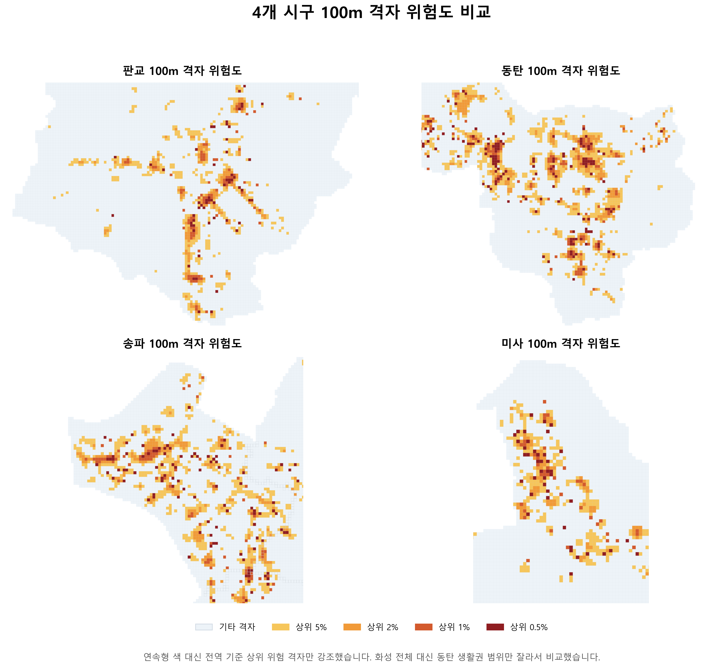
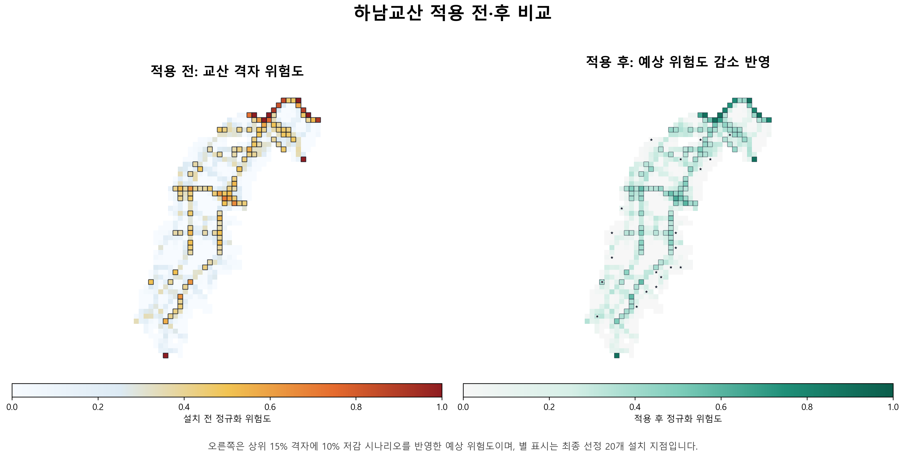

# LH Traffic Safety Analysis

4개 시·구의 교통안전 패턴을 학습한 뒤, 사고 이력이 충분하지 않은 하남교산에 전이 적용해 안전시설 우선순위를 제안한 공간 분석 프로젝트입니다. 핵심은 `위험도 산정 -> 전이 검증 -> 우선순위 추천 -> 시나리오 시각화`를 하나의 의사결정 흐름으로 연결한 점입니다.

## 빠른 판단

| 항목 | 내용 |
|------|------|
| 해결하려는 문제 | 사고 데이터가 부족한 신도시에서도 설치 우선순위를 설명 가능한 방식으로 정할 수 있는가 |
| 실제 의사결정 가치 | 위험 격자 식별, 우선 설치 후보 도출, `recommended_package`/`recommendation_reason` 기반 현장 설명까지 연결 |
| 재현 가능한 범위 | 공개 문서 검토, 핵심 시각화 확인, [교산 저감 매핑 CSV](./docs/data/gyosan_effect_reduction_by_gid.csv) 검토, [대시보드 UI 코드](./dashboard/app.py) 검토 |
| 재현 불가능한 범위 | 원본 공모전 데이터가 필요한 격자 통합, GRF 학습, 최종 우선순위 재산출 |
| 대체 확인 방법 | [핵심 시각화](#핵심-시각화), [검증 요약 문서](./docs/TOP35_UPGRADE_REPORT.md), [방법론 문서](./docs/grf_risk_methodology.md), [재현성 가이드](./docs/reproducibility_and_validation.md) |

## 왜 이 프로젝트가 가치 있었는가

- `데이터가 충분한 지역`에서 학습한 패턴을 `데이터가 부족한 신도시`에 전이 적용하는 설계를 직접 다뤘습니다.
- 결과를 위험지도에서 끝내지 않고 `시설 설치 우선순위`와 `설명 가능한 추천 사유`까지 연결했습니다.
- 면적가중 매핑, LORO 검증, 민감도/강건성 점검을 통해 "그럴듯한 그림"이 아니라 "검토 가능한 의사결정 자료"를 만들었습니다.

## 검증 요약

| 구분 | 핵심 수치 | 의미 | 근거 |
|------|-----------|------|------|
| 전이 검증 | Mean AUC `0.8604` | 지역을 하나씩 홀드아웃해도 분리력이 유지됨 | [TOP35_UPGRADE_REPORT.md](./docs/TOP35_UPGRADE_REPORT.md) |
| 핫스팟 포착력 | Mean Top-10% Lift `4.39x` | 상위 위험 구간이 무작위보다 훨씬 높은 사고 집중도를 보임 | [TOP35_UPGRADE_REPORT.md](./docs/TOP35_UPGRADE_REPORT.md) |
| 최저 성능 구간 | Worst holdout AUC `0.7979` | 가장 불리한 지역에서도 해석 가능한 수준의 전이 성능 확보 | [TOP35_UPGRADE_REPORT.md](./docs/TOP35_UPGRADE_REPORT.md) |
| 선정 강건성 | Monte Carlo mean Jaccard `0.503` | Top20 후보가 시나리오 변화에 완전히 무너지지 않음을 확인 | [TOP35_UPGRADE_REPORT.md](./docs/TOP35_UPGRADE_REPORT.md) |
| 현장 설명성 | `recommended_package`, `recommendation_reason` 컬럼 제공 | "왜 이 위치에 이 시설인가"를 슬라이드/Q&A 수준으로 설명 가능 | [TOP35_UPGRADE_REPORT.md](./docs/TOP35_UPGRADE_REPORT.md) |

## 핵심 시각화

### 4개 시·구 위험 격자 비교

화성 전체 대신 동탄 생활권만 잘라, 4개 시·구의 고위험 격자를 동일 기준으로 비교한 이미지입니다.

### 하남교산 적용 전/후 시나리오

좌측은 적용 전 위험도, 우측은 상위 위험 격자에 저감 시나리오를 반영한 적용 후 비교 이미지입니다. 이 그림은 `실측 사후 효과`가 아니라 `시나리오 기반 예상 변화`를 보여줍니다.

## 공개 저장소에서 확인할 수 있는 것

1. [재현성/검증 가이드](./docs/reproducibility_and_validation.md)에서 공개 저장소 기준 확인 가능 범위를 먼저 확인합니다.
2. [TOP35_UPGRADE_REPORT.md](./docs/TOP35_UPGRADE_REPORT.md)에서 전이 검증, 강건성, 실행 계획 수치를 확인합니다.
3. [grf_risk_methodology.md](./docs/grf_risk_methodology.md)와 [risk_index_methodology.md](./docs/risk_index_methodology.md)에서 위험도 정의와 평가 기준을 확인합니다.
4. [교산 저감 매핑 CSV](./docs/data/gyosan_effect_reduction_by_gid.csv)와 [build_readme_key_visuals.py](./scripts/build_readme_key_visuals.py)로 공개 산출물 구조를 검토합니다.

## 엔지니어링 신호

| 항목 | 내용 |
|------|------|
| Entry points | [analysis_pipeline/](./analysis_pipeline/), [dashboard/](./dashboard/), [scripts/](./scripts/) |
| 분석 구조 | 전처리/위험도/매칭/우선순위/시각화 단계를 노트북 순서로 분리 |
| 설명 가능성 | 위험도 정의, GRF 전이 논리, 교산 적용 배경을 각각 별도 문서로 분리 |
| 공개 기준 | 원본 데이터 제외, 검증 가능한 시각화·문서·CSV만 노출 |

## 코어 파이프라인

핵심 분석 흐름은 아래 노트북 순서입니다.

1. `01_grid_api_integration.ipynb`
2. `02_grf_blended_weights.ipynb`
3. `03_grf_risk_index.ipynb`
4. `04_gyosan_grid_matching.ipynb`
5. `05_grf_feature_integration.ipynb`
6. `07_gyosan_priority_ranking.ipynb`
7. `08_gyosan_infrastructure_forecast.ipynb`
8. `09_facility_site_selection.ipynb`
9. `10_gyosan_final_visualization.ipynb`

세부 순서 설명은 [analysis_pipeline/README.md](./analysis_pipeline/README.md)에 정리했습니다.

## 데이터 공지

- 공개 저장소에는 원본 공모전 데이터와 대용량 파생 데이터가 포함되지 않습니다.
- 로컬 재현 시 승인된 데이터만 `data/`에 넣거나 환경변수 `LH_DATA_ROOT`로 경로를 지정해야 합니다.
- 공개 저장소 기준 검증 가능 범위는 [docs/reproducibility_and_validation.md](./docs/reproducibility_and_validation.md)에 따로 정리했습니다.

## 더 보기

- 문서 인덱스: [docs/README.md](./docs/README.md)
- 재현성/검증 가이드: [docs/reproducibility_and_validation.md](./docs/reproducibility_and_validation.md)
- 위험지수 정의: [docs/risk_index_methodology.md](./docs/risk_index_methodology.md)
- GRF 방법론: [docs/grf_risk_methodology.md](./docs/grf_risk_methodology.md)
- 하남교산 적용 배경: [docs/gyosan_site_context.md](./docs/gyosan_site_context.md)
- 변경 이력: [CHANGELOG.md](./CHANGELOG.md)
